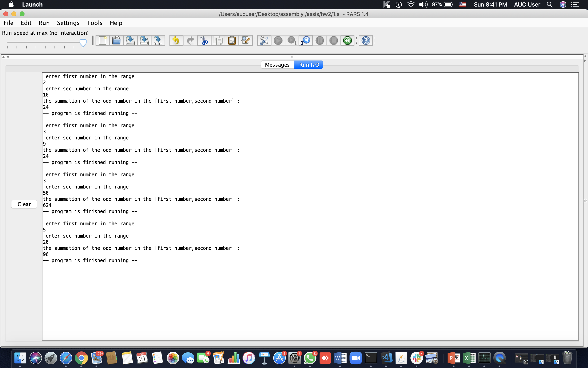

# risc-v_problems

 
 ## problem1----sum of odd numbers between two ranges
 

 
 

 
 
  ## problem2--------reversed string 
  
  

 
 

 
   ## problem3---------capitalizing the first letter of each word
   
   

 
 

 
   ## problem4---------multiplication(shift and add algo)
    
  

 
 

 
   ## problem5-----------word_guessing_game
     
   

 
 

 
   ## problem6-------------converting from a normal string to  base-64 encoded 
      
   

 
 

